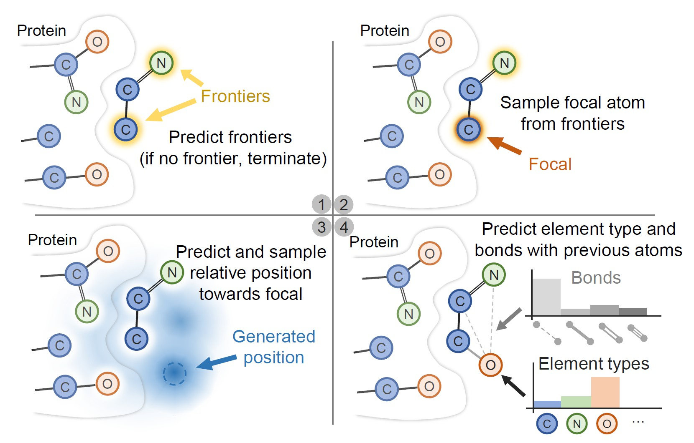
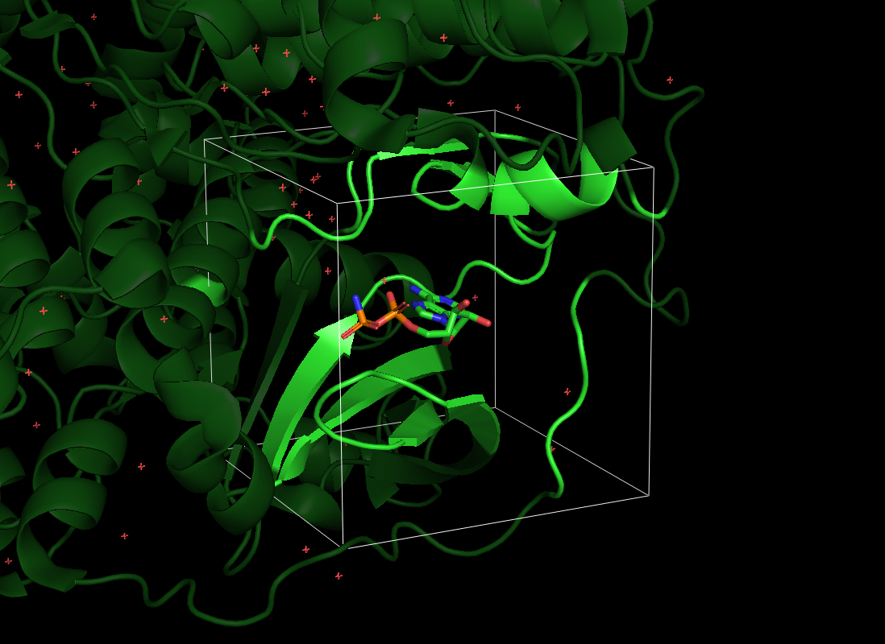

# Pocket2Mol: Efficient Molecular Sampling Based on 3D Protein Pockets

[Pocket2Mol](https://arxiv.org/abs/2205.07249) used equivariant graph neural networks to improve efficiency and molecule quality of [previous structure-based drug design model](https://arxiv.org/abs/2203.10446).




## Installation
**Update**: Now the codes are compatible with PyTorch Geometric (PyG) >= 2.0.
### Dependency
The codes have been tested in the following environment:
Package  | Version
--- | ---
Python | 3.8.12
PyTorch | 1.10.1
CUDA | 11.3.1
PyTorch Geometric | **2.0.0**
RDKit | 2022.03
BioPython | 1.79
<!-- OpenBabel | 3.1.0 -->
<!-- NOTE: Current implementation relies on PyTorch Geometric (PyG) < 2.0.0. We will fix compatability issues for the latest PyG version in the future. -->
### Install via conda yaml file (cuda 11.3)
```bash
conda env create -f env_cuda113.yml
conda activate Pocket2Mol
```

### Install manually

``` bash
conda create -n Pocket2Mol python=3.8
conda activate Pocket2Mol

# Install PyTorch (for cuda 11.3)
conda install pytorch==1.10.1 cudatoolkit=11.3 -c pytorch -c conda-forge
# Install PyTorch Geometric (>=2.0.0)
conda install pyg -c pyg

# Install other tools
conda install -c conda-forge rdkit
conda install biopython -c conda-forge # used only in sample_for_pdb.py
conda install pyyaml easydict python-lmdb -c conda-forge

# Install tensorboard only for training
conda install tensorboard -c conda-forge  
```


## Datasets

Please refer to [`README.md`](./data/README.md) in the `data` folder.

## Sampling

**NOTE: It is highly recommended to add `taskset -c` to use only one cpu when sampling (e.g. `taskset -c 0 python sample_xxx.py` to use CPU 0), which is much faster. The reason is not clear yet.**

### Sampling for pockets in the testset

To sample molecules for the i-th pocket in the testset, please first download the trained models following [`README.md`](./ckpt/README.md) in the `ckpt` folder. 
Then, run the following command:

```bash
python sample.py --data_id {i} --outdir ./outputs  # Replace {i} with the index of the data. i should be between 0 and 99 for the testset.
```

We recommend to specify the GPU device number and restrict the cpu cores using command like:

```bash
CUDA_VISIBLE_DIVICES=0  taskset -c 0 python sample.py --data_id 0 --outdir ./outputs
```
We also provide a bash file `batch_sample.sh` for sampling molecules for the whole test set in parallel. For example, to sample with three workers, run the following commands in three panes.
```bash
CUDA_VISIBLE_DEVICES=0 taskset -c 0 bash batch_sample.sh  3 0 0

CUDA_VISIBLE_DEVICES=0 taskset -c 1 bash batch_sample.sh  3 1 0

CUDA_VISIBLE_DEVICES=0 taskset -c 2 bash batch_sample.sh  3 2 0
```
The three parameters of `batch_sample.py` represent the number of workers, the index of current worker and the start index of the datapoint in the test set, respectively.

**NOTE: We find it much faster to use only one CPU for one sampling program (i.e., set `taskset -c` to use one CPU).**

### Sampling for PDB pockets 
To generate ligands for your own pocket, you need to provide the `PDB` structure file of the protein, the center coordinate of the pocket bounding box, and optionally the side length of the bounding box (default: 23Å). Note that there is a blank before the first value of the `center` parameter. The blank cannot be omitted if the first value is negative (e.g., `--center  " -1.5,28.0,36.0"`).

Example:

```bash
python sample_for_pdb.py \
      --pdb_path ./example/4yhj.pdb
      --center " 32.0,28.0,36.0"
```




## Training

```
python train.py --config ./configs/train.yml --logdir ./logs
```
For training, we recommend to install [`apex` ](https://github.com/NVIDIA/apex) for lower gpu memory usage. If  so, change the value of `train/use_apex` in the `configs/train.yml` file.

## Citation
```
@inproceedings{peng2022pocket2mol,
  title={Pocket2Mol: Efficient Molecular Sampling Based on 3D Protein Pockets},
  author={Xingang Peng and Shitong Luo and Jiaqi Guan and Qi Xie and Jian Peng and Jianzhu Ma},
  booktitle={International Conference on Machine Learning},
  year={2022}
}
```

## Contact 
Xingang Peng (xingang.peng@gmail.com)
